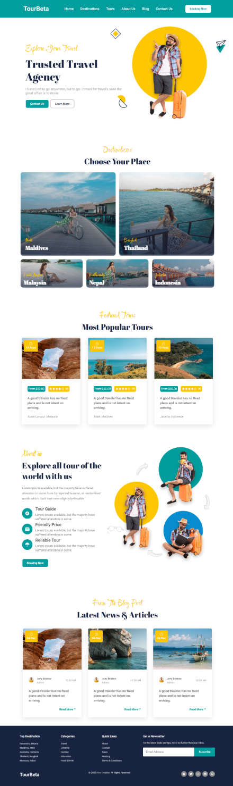

  

   
   

## Table of contents

- [Overview](#overview)
  - [Screenshot](#screenshot)
- [My process](#my-process)
  - [Built with](#built-with)
- [Acknowledgement](#acknowledgement)
- [License](#License)

## Overview

What this is:

  <h2>TourBeta - Travel website</h2>

  TourBeta is a simple travel website,  built using HTML, CSS, and JavaScript.

  <a href="https://tourbeta.netlify.app"><strong>➥ Live Demo</strong></a>

 

## Screenshot

## My process

-Built the html layout
-Styled with css
-Added some features with javascript
-Made responsive

## Built with

- Semantic HTML5 markup
- CSS custom properties
- Flex and grid
- Javascript

## Acknowledgement 

This project was built from https://codewithsadee.github.io/tourest/
Big thanks to @codewithsadee for making this available for learning 

## License

This project is **free to use** and does not contains any license.
